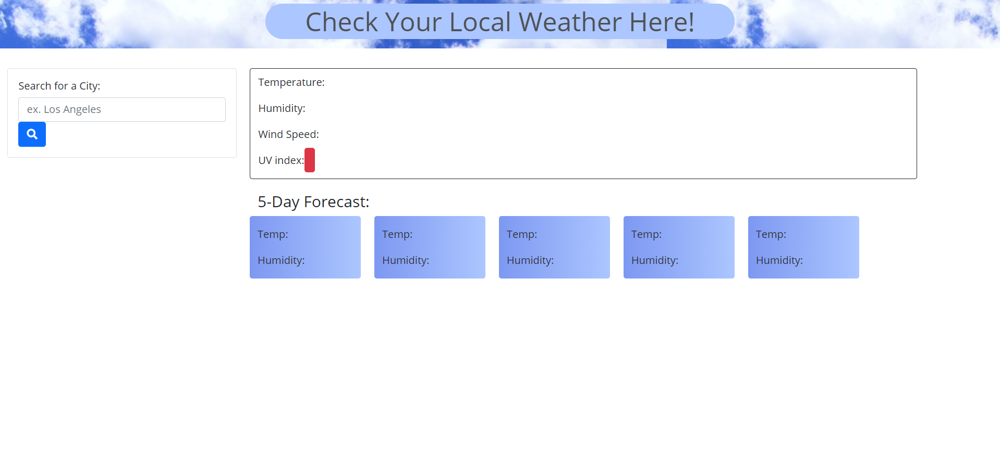

# 06 Weather App

## Description

This is a simple weather app, which will display the current weather and a 5 day forecast for any city the user inputs. It utilizes the API [OpenWeather API](https://openweathermap.org/api). `localStorage` is used to remember the previously inputted cities.

## Screenshots
```
Here is the website with no city logged


Here is the website with 1 city logged


Here is the website with multiple cities logged


```

